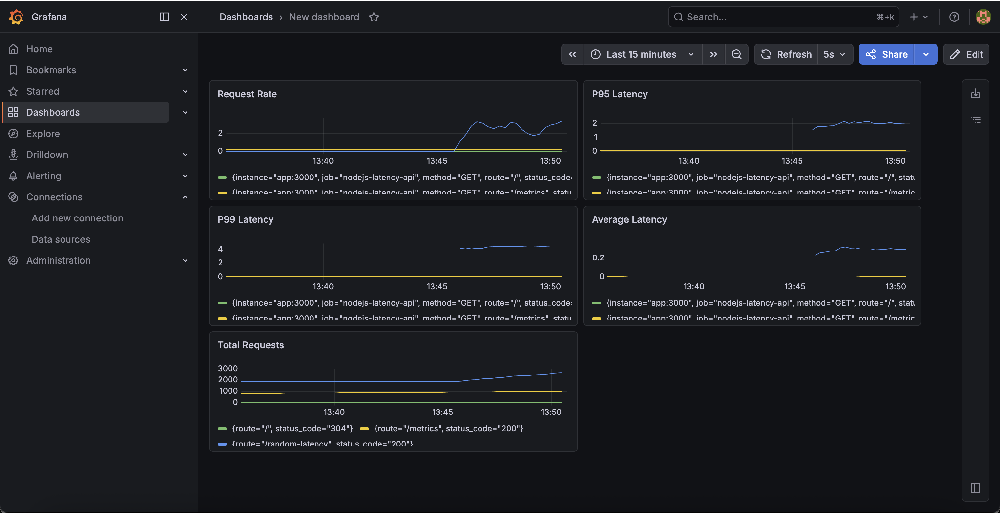
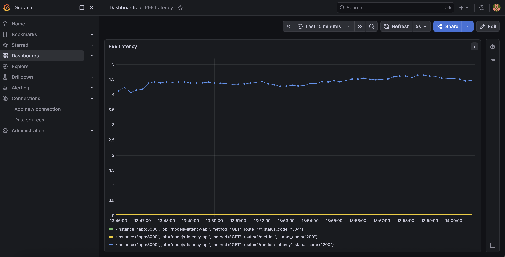
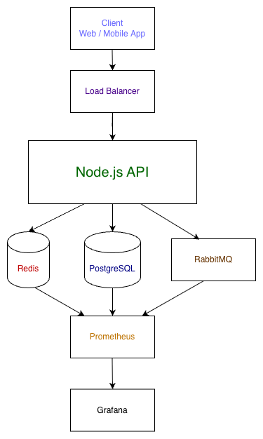
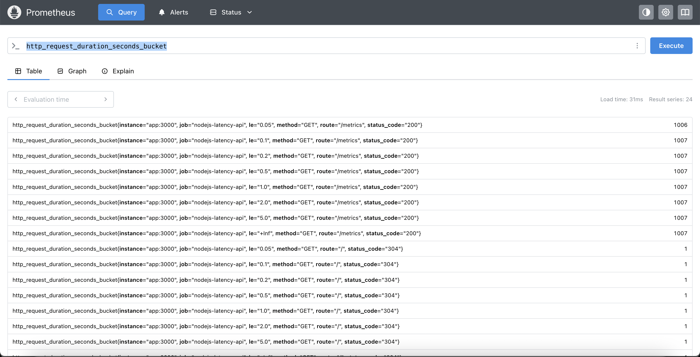

# Understanding P95 and P99 Latency in Production Systems



A production-focused Node.js observability and latency monitoring project demonstrating:

- P95 and P99 latency
- Tail latency behavior
- Real-world production bottlenecks
- Observability with Prometheus & Grafana
- Distributed systems monitoring
- Node.js performance engineering
- Production latency analysis

---

# Why This Project Exists

In many production systems, average latency can look perfectly healthy while users still experience severe delays.

Example:

| Requests | Response Time |
|---|---|
| 95 Requests | 100ms |
| 5 Requests | 5000ms |

The average response time may still appear acceptable.

However:
- some users experience major delays
- P95 increases significantly
- P99 becomes extremely high

This is where tail latency becomes critical.

Modern production systems monitor:
- P50
- P95
- P99
- throughput
- error rates

instead of relying only on averages.

---

# What Are P95 and P99?

## P95 Latency

95% of requests complete faster than this value.

If:

```txt
P95 = 300ms
```

Then:
- 95% requests are below 300ms
- 5% requests are slower than 300ms

---

## P99 Latency

99% of requests complete faster than this value.

If:

```txt
P99 = 2s
```

Then:
- 99% requests are below 2 seconds
- 1% requests are extremely slow

P99 is critical for identifying:
- tail latency
- production bottlenecks
- slow dependencies
- distributed system failures

---

# Production Monitoring Dashboard



The Grafana dashboard demonstrates:

- Request throughput
- P95 latency
- P99 latency
- Average response time
- Tail latency spikes
- Real-time monitoring

This simulates real-world production monitoring scenarios where average latency may appear healthy while users still experience performance degradation.

---

# Production Architecture



This architecture simulates a production-grade observability and monitoring environment.

Components included:

- Client Applications
- Load Balancer
- Node.js API
- Redis Cache
- PostgreSQL
- RabbitMQ
- Prometheus
- Grafana

The project demonstrates how distributed systems monitor:
- request throughput
- P95 latency
- P99 latency
- latency spikes
- production bottlenecks

> Note:
>
> Redis, PostgreSQL, and RabbitMQ are included as architecture components to demonstrate how latency monitoring and observability integrate within distributed backend systems.
>
> This repository primarily focuses on P95/P99 latency analysis, Prometheus metrics, Grafana observability, and production monitoring concepts.

---

# Prometheus Metrics Monitoring



The application exports Prometheus histogram metrics for:

- Request duration
- Request count
- Histogram buckets
- Latency distribution
- Quantile calculations

Prometheus metrics are used to calculate:
- P50 latency
- P95 latency
- P99 latency

This demonstrates production-grade observability practices commonly used in distributed backend systems.

---

# Real Production Causes of High P99 Latency

High P99 latency is commonly caused by:

- Slow database queries
- Missing indexes
- Redis cache misses
- RabbitMQ queue backlog
- External API delays
- Event loop blocking
- CPU spikes
- Large payload serialization
- Connection pool exhaustion
- Retry storms in microservices
- N+1 database queries
- Garbage collection pauses

---

# Node.js Performance Considerations

This project also demonstrates common Node.js performance issues:

- Event loop blocking
- Heavy synchronous processing
- Excessive Promise concurrency
- Large JSON parsing
- CPU-bound operations
- Unoptimized async flows

These issues commonly contribute to increased tail latency in backend systems.

---

# Project Structure

```txt
p95-p99-latency-production-systems
│
├── src
│   └── server.js
│
├── prometheus
│   └── prometheus.yml
│
├── screenshots
│
├── docs
│   ├── architecture.md
│   └── production-checklist.md
│
├── docker-compose.yml
├── Dockerfile
├── package.json
└── README.md
```

---

# Running the Project

## Install Dependencies

```bash
npm install
```

---

## Start Services

```bash
docker compose up --build
```

---

# API

Open:

```txt
http://localhost:3000
```

---

# Grafana Dashboard

Open:

```txt
http://localhost:3001
```

Default credentials:

```txt
admin
admin
```

---

# Prometheus

Open:

```txt
http://localhost:9090
```

---

# API Endpoints

## Root Endpoint

```bash
GET /
```

Returns available endpoints.

---

## Fast Endpoint

```bash
GET /fast
```

Simulates normal low-latency API behavior.

Approximate latency:

```txt
~50ms
```

---

## Slow Endpoint

```bash
GET /slow
```

Simulates slow production dependency behavior.

Approximate latency:

```txt
~2000ms
```

---

## Random Latency Endpoint

```bash
GET /random-latency
```

Simulates realistic production traffic patterns where:
- most requests are fast
- a small percentage become extremely slow

This helps demonstrate:
- P95 latency
- P99 latency
- tail latency spikes

---

## Metrics Endpoint

```bash
GET /metrics
```

Prometheus metrics endpoint.

---

# Generate Load Testing Traffic

Run continuous traffic simulation:

```bash
while true; do
  curl -s http://localhost:3000/random-latency > /dev/null
  sleep 0.2
done
```

This generates realistic traffic patterns that produce:
- P95 spikes
- P99 spikes
- latency fluctuations
- throughput variations

The generated traffic can be monitored directly inside Grafana dashboards.

---

# Monitoring Queries

## P95 Latency

```promql
histogram_quantile(
  0.95,
  sum(rate(http_request_duration_seconds_bucket[5m])) by (le)
)
```

---

## P99 Latency

```promql
histogram_quantile(
  0.99,
  sum(rate(http_request_duration_seconds_bucket[5m])) by (le)
)
```

---

# Example Production Scenario

Imagine:

- 95% users receive responses in 100ms
- 5% users receive responses in 5 seconds

Average latency may still appear acceptable.

But:
- P95 increases significantly
- P99 becomes extremely high
- user experience degrades badly

This is why modern distributed systems monitor:
- P50
- P95
- P99
- throughput
- error rate
- queue backlog

instead of relying only on averages.

---

# Observability Stack

This repository demonstrates observability integration using:

- Prometheus
- Grafana
- Docker
- Node.js Metrics
- Histogram Monitoring
- Time-Series Monitoring

The architecture can also integrate with:
- ELK Stack
- OpenTelemetry
- CloudWatch

---

# Recommended Production Metrics

Production systems should monitor:

- API latency
- P95 latency
- P99 latency
- Error rate
- Queue backlog
- Database latency
- Cache hit ratio
- CPU usage
- Memory usage
- Event loop lag

---

# Common Fixes for High P99 Latency

Common optimization strategies:

- Database indexing
- Redis caching
- Queue-based processing
- Async background jobs
- Pagination
- Connection pooling
- Circuit breakers
- Bulk processing
- Rate limiting
- Request batching

---

# Why Tail Latency Matters

Average latency tells you how the system behaves normally.

P95 and P99 tell you how the system behaves when things start failing.

In distributed systems, tail latency directly impacts:
- user experience
- scalability
- reliability
- SLA compliance

---

# Engineering Focus Areas

This repository focuses on:

- Production Engineering
- Observability
- Distributed Systems
- Performance Optimization
- Scalability Engineering
- Tail Latency Analysis
- Monitoring Architecture
- Node.js Performance

---

# Tech Stack

- Node.js
- Express.js
- Prometheus
- Grafana
- Docker
- Redis
- PostgreSQL
- RabbitMQ

---

# License

This project is licensed under the [MIT License](./LICENSE).
