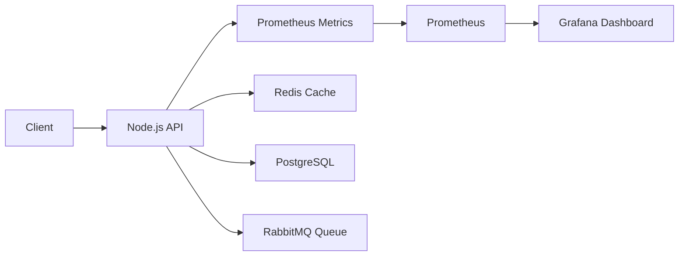

# Understanding P95 and P99 Latency in Production Systems

A production-focused Node.js project demonstrating:

- P95 vs P99 latency
- Tail latency behavior
- Real-world performance bottlenecks
- Observability with Prometheus & Grafana
- Production monitoring strategies
- Node.js performance considerations

---

# Why This Project Exists

In many production systems, average latency can look perfectly healthy while users still experience slow requests.

Example:

| Requests | Response Time |
|---|---|
| 95 Requests | 100ms |
| 5 Requests | 5000ms |

The average response time may still appear acceptable.

However, some users experience severe delays.

This is where P95 and P99 latency become critical.

---

# What Are P95 and P99?

## P95 Latency

95% of requests are completed faster than this value.

If P95 = 300ms:

- 95% requests are below 300ms
- 5% requests are slower than 300ms

---

## P99 Latency

99% of requests are completed faster than this value.

If P99 = 2s:

- 99% requests are below 2 seconds
- 1% requests are extremely slow

P99 helps identify tail latency problems in distributed systems.

---

# Real Production Causes of High P99 Latency

High P99 latency is commonly caused by:

- Slow database queries
- Missing indexes
- Redis cache misses
- RabbitMQ queue backlog
- External API delays
- CPU spikes
- Event loop blocking
- Large payload serialization
- Connection pool exhaustion
- Retry storms in microservices
- N+1 database queries
- Garbage collection pauses

---

# Node.js Specific Performance Issues

This project also demonstrates common Node.js latency problems:

- Event loop blocking
- Heavy synchronous processing
- Excessive Promise concurrency
- Large JSON parsing
- CPU-bound operations
- Unoptimized async flows

---

# Architecture



---

# Project Structure

```txt
p95-p99-latency-production-systems
│
├── src
│   └── server.js
│
├── prometheus
│   └── prometheus.yml
│
├── grafana
│
├── diagrams
│
├── docs
│   ├── architecture.md
│   └── production-checklist.md
│
├── docker-compose.yml
├── package.json
└── README.md
```

---

# Running the Project

## Install Dependencies

```bash
npm install
```

---

## Start the API

```bash
npm run dev
```

---

# API Endpoints

## Root Endpoint

```bash
GET /
```

Returns available endpoints.

---

## Fast Endpoint

```bash
GET /fast
```

Simulates normal fast API behavior.

Approximate latency:
- ~50ms

---

## Slow Endpoint

```bash
GET /slow
```

Simulates slow production dependency behavior.

Approximate latency:
- ~2000ms

---

## Random Latency Endpoint

```bash
GET /random-latency
```

Simulates realistic production traffic where:
- Most requests are fast
- Small percentage become slow

This helps demonstrate:
- P95 latency
- P99 latency
- Tail latency spikes

---

## Metrics Endpoint

```bash
GET /metrics
```

Prometheus metrics endpoint.

---

# Example Production Scenario

Imagine:

- 95% users receive responses in 100ms
- 5% users receive responses in 5 seconds

Average latency may still appear acceptable.

But:
- P95 increases significantly
- P99 becomes extremely high
- User experience degrades badly

This is why modern production systems monitor:
- P50
- P95
- P99
- Error rate
- Throughput

instead of relying only on averages.

---

# Observability Stack

This repository is designed to integrate with:

- Prometheus
- Grafana
- ELK Stack
- OpenTelemetry
- CloudWatch

---

# Recommended Monitoring Metrics

Production systems should monitor:

- API latency
- P95 latency
- P99 latency
- Error rate
- Queue backlog
- Database latency
- Cache hit ratio
- CPU usage
- Memory usage
- Event loop lag

---

# Common Fixes for High P99 Latency

Common optimization strategies:

- Database indexing
- Redis caching
- Queue-based processing
- Async background jobs
- Pagination
- Connection pooling
- Circuit breakers
- Bulk processing
- Rate limiting
- Request batching

---

# Why Tail Latency Matters

Average latency tells you how the system behaves normally.

P95 and P99 tell you how the system behaves when things start failing.

In distributed systems, tail latency directly impacts:
- User experience
- Scalability
- Reliability
- SLA compliance

---

# Tech Stack

- Node.js
- Express.js
- Prometheus
- Grafana
- Docker
- Redis
- PostgreSQL
- RabbitMQ

---

# License

MIT License