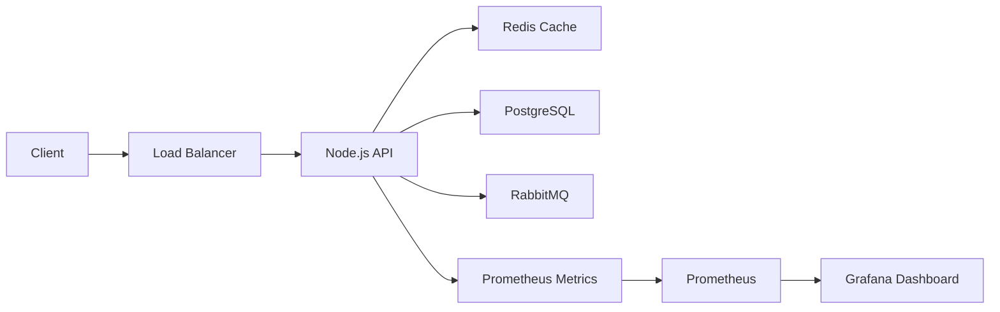

# Production Architecture

This project simulates a production-ready backend monitoring environment.

---

# High-Level Architecture

---

# Components

## Node.js API

Responsible for:
- API processing
- Request handling
- Latency simulation
- Metrics generation

---

## Prometheus

Responsible for:
- Metrics scraping
- Time-series storage
- Monitoring aggregation

---

## Grafana

Responsible for:
- Visualization
- Dashboarding
- Observability

---

# Simulated Production Problems

The repository demonstrates:

- Tail latency spikes
- Slow dependencies
- Random latency behavior
- Uneven response distribution
- P95/P99 latency increase

---

# Why This Matters

Many systems monitor only average latency.

However:

- Averages hide user pain
- Tail latency impacts real customers
- Distributed systems amplify latency problems

P95 and P99 are critical for:
- Scalability
- Reliability
- User experience
- SLA compliance